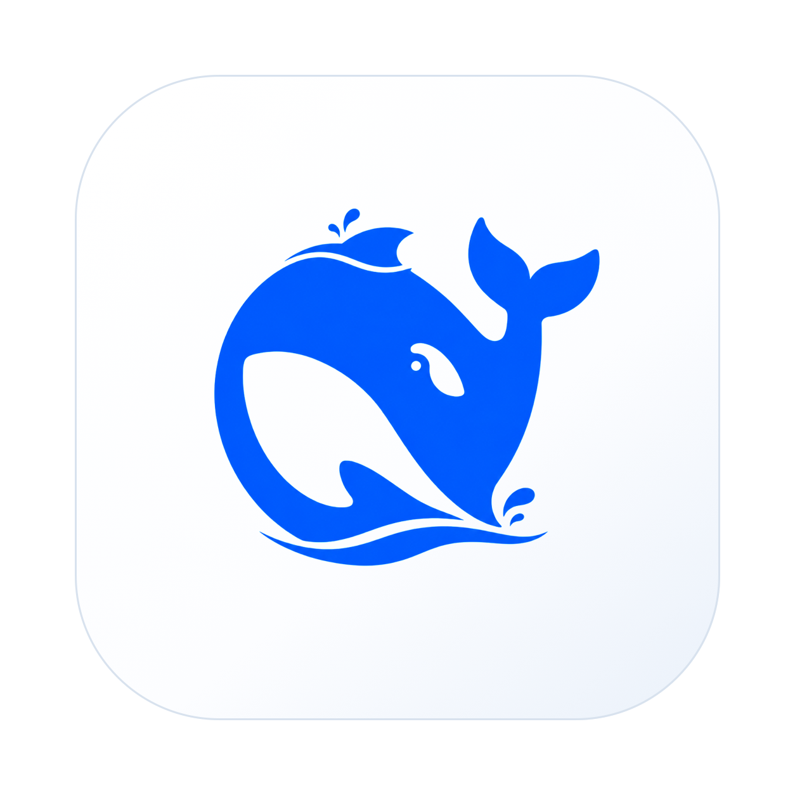
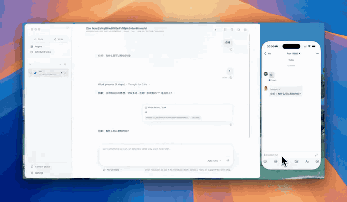
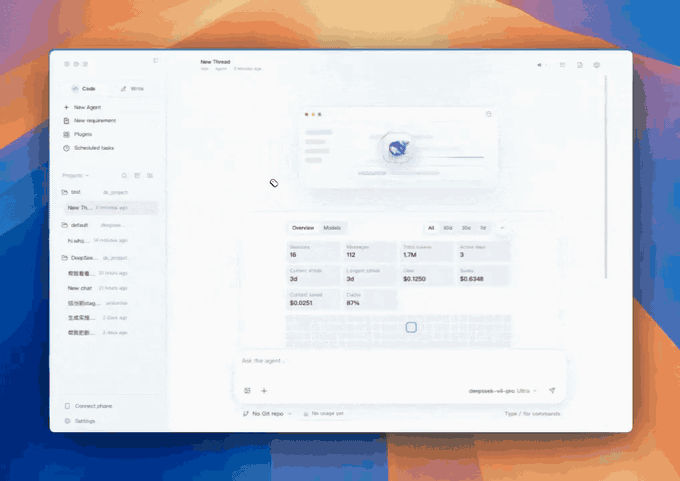
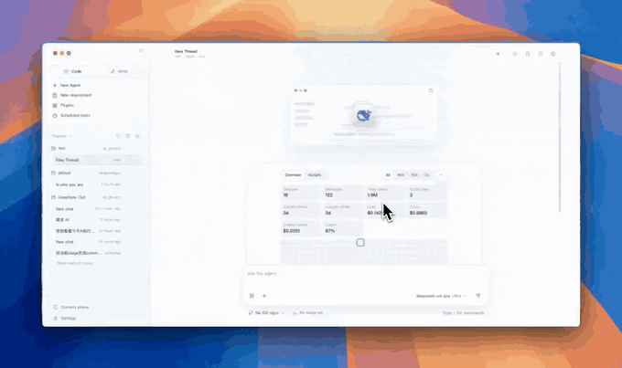
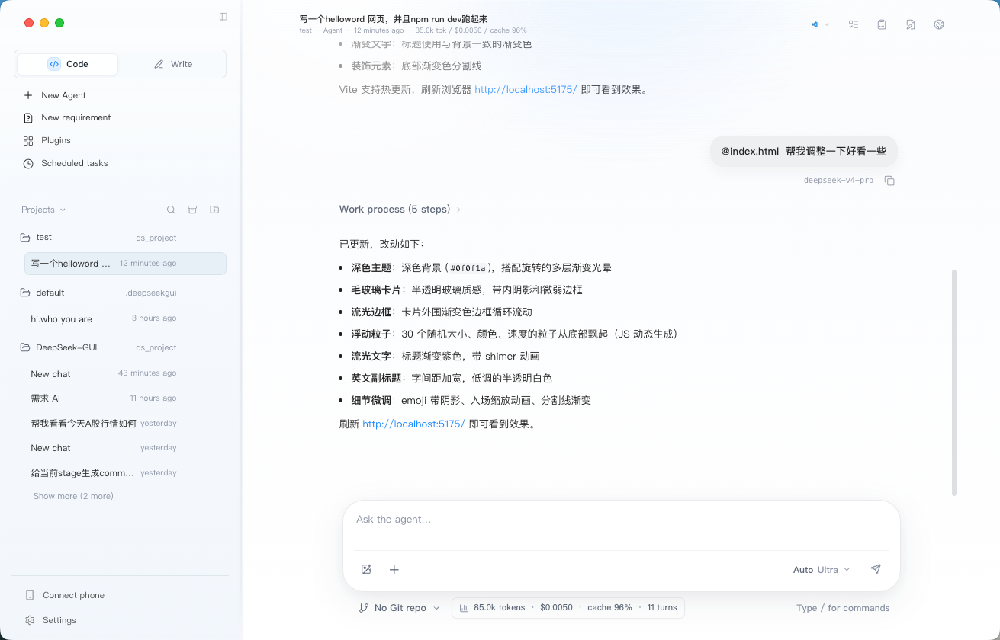
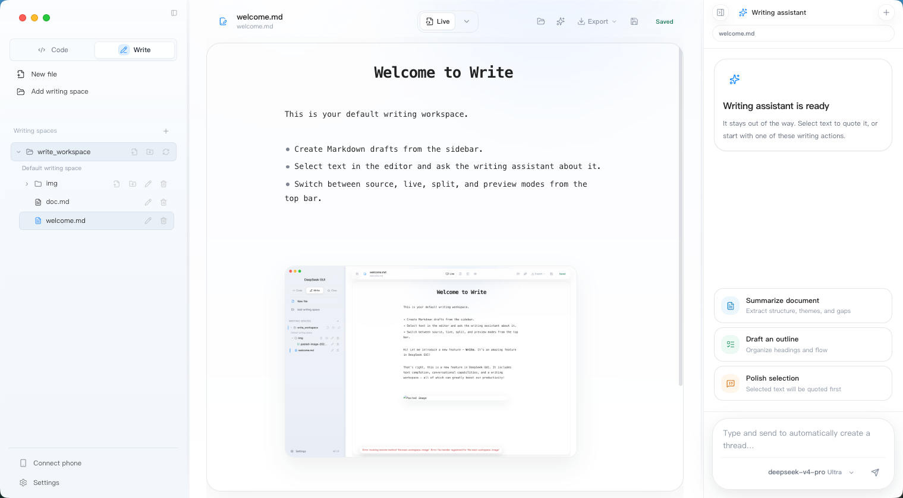
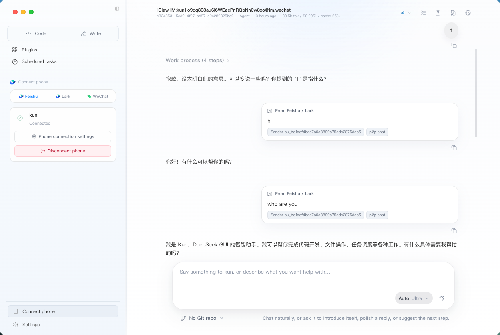

<p align="center">
  
</p>

# DeepSeek GUI

[简体中文](./README.md) | English

> Bring Kun's high-token-ROI local agent runtime into a desktop workbench: **Code** for project work, **Write** for documents, and **Connect phone** for IM automation and scheduled tasks. Every token is steered toward requirements, code, decisions, and results.

[Website](https://deepseek-gui.com) | [Download](https://deepseek-gui.com)

[](https://github.com/XingYu-Zhong/DeepSeek-GUI/releases)
[](./LICENSE)

DeepSeek GUI is a local desktop workbench for developers and frequent AI users. It uses Kun as the only runtime and turns the terminal agent experience into an easier, longer-lived app: choose a workspace, start a task, watch reasoning and tool calls stream in, review file changes, and approve sensitive actions when needed.

The goal is not to ship another chat wrapper. The goal is to make DeepSeek feel like a reliable desktop partner for real project work. Kun's core advantage is high token ROI: the same context budget spends less on repeated prefixes, giant tool catalogs, and runaway output, and more on the information that actually moves the task forward.

---

<p align="center">
  <a href="src/asset/img/code.mp4">
    
  </a>
  <a href="src/asset/img/write.mp4">
    
  </a>
</p>

## More Demos

<p align="center">
  <a href="src/asset/img/feishu.mp4">
    
  </a>
</p>
<p align="center"><em>Feishu / Lark / WeChat connection demo.</em></p>

<p align="center">
  <a href="src/asset/img/sdd.mp4">
    
  </a>
</p>
<p align="center"><em>Requirement drafting and planning demo.</em></p>

<p align="center">
  <a href="src/asset/img/web.mp4">
    
  </a>
</p>
<p align="center"><em>Web tools demo.</em></p>

## Why Kun Delivers High Token ROI

Kun makes token economy the default behavior of the agent loop, not a cleanup step after the fact. It does more than compress text: before each model call, it decides which information is worth entering context.

| Kun advantage | Where the ROI comes from |
| --- | --- |
| **Cache-first agent loop** | Stable system prompts, tool schemas, and immutable prefixes make DeepSeek-native cache hits more likely, so long sessions do not keep paying for the same background. |
| **Tool context on demand** | When MCP catalogs are large, Kun can search for relevant tools first, then describe and call the target tool instead of sending every tool schema on every turn. |
| **Context hygiene** | Long tool results, long arguments, base64 payloads, repeated tool loops, and low-value history are bounded while code, paths, errors, decisions, and open tasks are preserved. |
| **Visible usage payback** | Runtime telemetry tracks cache hit/miss, token usage, and estimated savings; the GUI surfaces Token economy savings so cost return is observable over time. |

The result: Kun is built for real project work with long tasks, long sessions, and many tools. It keeps the model's attention on high-value context, helping the same API budget produce more useful progress.

## What We Built

- A desktop app around the Kun local runtime, with default runtime auto-start and management.
- A full chat workbench with multiple sessions, streaming output, history, interruption, and resend flows.
- Local workspace integration so the agent can read, edit, and create files in real projects.
- Change review surfaces that make every file modification visible and inspectable.
- First-run onboarding, settings, language/theme/font controls, notifications, local logs, and update entry points.
- Graphical Skill and MCP management so users can extend the agent without hand-editing every config file.
- Connect phone automation with Feishu / Lark / WeChat integration, dedicated IM agents, local webhook / relay support, and scheduled tasks.
- A dedicated Write workbench with writing spaces, a Markdown file tree, live editing/preview, inline completion, and selection-based inline agent actions.
- New requirement drafts, plans, thread todos, long-running goals, and code review so tasks can move from idea to execution to review.
- Pre-built macOS, Windows, and Linux installers; source builds remain available.

## Highlights

- **Desktop chat workbench**: multi-session chat with streamed replies, reasoning, tool calls, approval requests, and file changes in one place.
- **Project workspaces**: choose a local directory for each task, organize sessions by workspace, preview files, open files in your editor, and pick Git branches.
- **New requirements**: draft background, goals, and acceptance criteria; ask Requirement AI to clarify missing questions or research options; then generate an implementation plan.
- **Plans and todos**: `/plan` and New requirement both create editable plan files, while the right-side Plan panel syncs thread todos for trackable execution.
- **Goals**: `/goal` sets a long-running objective for the current thread, with pause, resume, clear, and complete states so the agent can keep working toward the same outcome.
- **Code review**: `/review` can inspect current uncommitted changes, a base branch diff, a commit, or custom review instructions, with findings shown as review cards.
- **Side conversations and thread control**: `/btw` opens a context-inheriting side conversation; threads also support compact, fork, archive, and restore flows.
- **Change review**: inline diffs and a side review panel help you understand exactly what the agent changed.
- **Controlled permissions**: choose read-only, workspace-write, full-access, or external sandbox modes, and decide when tool calls require approval.
- **Managed runtime**: use the bundled Kun by default, or point the app at your own `kun` executable.
- **Skill and MCP support**: create Skills, edit MCP config, add common tools, and open the related folders from the UI.
- **Feature-flagged agent extensions**: Kun can enable MCP, web fetch/search, Skills, standalone CLI use, image attachments, cross-session memory, and delegated subagents by config; Settings shows the runtime-reported capability and diagnostics state.
- **Connect phone**: run a background agent alongside normal chat, with current support for Feishu / Lark / WeChat, IM webhook / relay flows, and scheduled tasks.
- **Scheduled tasks**: create one-time, daily, interval, or manual tasks with their own workspace, model, and reasoning effort so Kun can run while the computer is awake.
- **Write mode**: manage `~/.deepseekgui/write_workspace` and custom writing spaces, browse Markdown files, use live Markdown editing, preview relative images, get DeepSeek FIM short completion / inspiration completion with optional cross-document BM25 + keyword retrieval, export the current document as `HTML / PDF / DOC / DOCX`, and invoke the writing assistant directly from selected text.
- **High token ROI**: Kun keeps prompt prefixes stable, tracks DeepSeek-native cache hit/miss fields, compacts context and tool output, and uses MCP search to discover tools progressively so tokens stay focused on requirements, code, decisions, and results.
- **Friendly first launch**: choose language, add your DeepSeek API key, and optionally set a compatible Base URL.
- **Local-first**: preferences, sessions, logs, and runtime config stay on your machine; model calls use your own DeepSeek API key.
- **English and Chinese UI**: switch languages from Settings at any time.
- **Cross-platform use**: macOS `.dmg/.zip`, Windows `.exe`, and Linux `.AppImage`; source builds remain available.

## Runtime: Kun

The only active local agent runtime in DeepSeek-GUI today is
**Kun** (shipped under `kun/`), a self-contained
TypeScript package that boots a local HTTP/SSE server as the
single boundary between the GUI and the agent loop.

The name Kun is inspired by the great fish in Zhuangzi's line,
"In the northern sea there is a fish; its name is Kun." The idea is
not a temporary chat shell, but a deeper local runtime that can carry
longer context, richer tools, and sustained project collaboration.

Kun's operating principle is to raise the ROI of every token. The
user's context budget should go toward requirements, code, decisions,
and results, not repeated tool schemas, runaway tool output, invalid
history, or prefixes that could have been reused from cache. It is
optimized less for one-off questions and more for real workflows that
read and write projects, call tools repeatedly, and carry context over
long sessions.

Kun fuses a design that has been battle-tested in the
wild:

- **The cache-first agent loop borrowed from Reasonix**: immutable prompt prefix (with sha256 fingerprint), append-only session log, bounded TTL/LRU cache, inflight tracking with guaranteed cleanup, mid-turn steering queue, context compaction that preserves pinned constraints, and cache/usage telemetry.
- **Token economy and tool-context optimization**: Kun stabilizes system prompts and tool schemas, reads DeepSeek-native cache hit/miss fields, bounds long tool results, long arguments, base64 payloads, and repeated tool loops, and can use `mcp_search` / `mcp_describe` / `mcp_call` to discover MCP tools progressively when a tool catalog is too large to advertise all at once.

> Thanks to the Reasonix team for sharing the runnable references
> that made this design pillar testable in the first place. Nearly
> every performance trait of Kun — cache hit rate, token replay,
> reconnect, and interruptable approvals — can be traced back to
> this project. The full design rationale
> and the borrow map live in
> [`docs/kun-architecture.md`](docs/kun-architecture.md).

If you want the dedicated write-up for cache behavior, including
stable prefixes, tool schema canonicalization, DeepSeek native
hit/miss accounting, tool-pair healing, and validation strategy, see
[`docs/kun-cache-optimization.md`](docs/kun-cache-optimization.md).

Kun's larger agent capabilities are controlled by feature flags:
`capabilities.mcp` connects third-party MCP servers,
`capabilities.web` exposes `web_fetch` / `web_search`,
`capabilities.skills` discovers `skill.json` and legacy `SKILL.md`,
`capabilities.attachments` enables image attachments with text-model fallback, `capabilities.memory`
enables cross-session recall, and `capabilities.subagents` allows
budgeted delegated child runs. `kun run`, `kun chat`, and `kun exec`
can run without the GUI. The GUI reads `/v1/runtime/info` and
`/v1/runtime/tools` in Settings to show what is actually available.
These capabilities are off by config or limited by model capability
until explicitly enabled; examples and troubleshooting live in
[`kun/README.md`](kun/README.md).

Simplified architecture:

```text
Renderer (React)
  → KunRuntimeProvider
  → preload: dsGui.runtimeRequest / startSse
  → main: LocalHttpRuntimeAdapter
  → kun serve (HTTP + SSE)
  → cache-first AgentLoop
```

Settings live under **Settings → Agent runtime**: binary path, port,
auto-start, API key, base URL, runtime token, data dir, model,
approval policy, sandbox mode, and the insecure switch. If an older
provider was saved before, settings are migrated into
`agents.kun` on load; after saving, only Kun settings
remain.

The full endpoint list, CLI flags, environment variables, data dir
layout, and SSE event schema are documented in
[`kun/README.md`](kun/README.md).

## Who It Is For

- Developers who want DeepSeek to work on real codebases without living in a terminal.
- Teams that need to see what the agent did, which files changed, and which operations required approval.
- Users who maintain multiple projects or long-running conversations and want reusable Skill/MCP setup.
- Anyone who wants a local desktop workbench connected to the official DeepSeek API or a compatible endpoint.

---

## Workbench And Entry Points

DeepSeek GUI is centered on two main workbenches, **Code** and **Write**,
with additional entry points for **Connect phone**, **Scheduled tasks**,
and **Plugins / Skills / MCP**. They share the same Kun runtime and
settings, but keep sessions, workspaces, and layouts separate so you
can switch by task.

### Code Mode

The development workbench for real codebases: bind a local project directory, read and edit files, run commands, and review changes.

<p align="center">
  
</p>

- Organize multiple agent sessions by workspace, with streamed reasoning, tool calls, and file changes in one view.
- Inline diffs, a change-review panel, and permission modes from read-only to full access.
- New requirement drafts, `/plan`, the right-side Plan panel, thread todos, and `/goal` help complex work move from clarification to planning to execution.
- `/review`, `/btw`, thread compaction, thread forking, archive, and restore support longer-lived project conversations.
- Quick-start cards for common tasks such as project mapping, bug fixing, implementation planning, and UI polish.

### Write Mode

A dedicated Markdown writing workbench that keeps writing files, save state, and AI assistance separate from Code sessions.

<p align="center">
  
</p>

- Manage `~/.deepseekgui/write_workspace` plus custom writing spaces from the left file tree.
- Switch between **Live / Source / Split / Preview**; Live keeps Markdown source on the active line and renders the rest.
- Export the current Markdown document from the toolbar as `HTML / PDF / DOC / DOCX`, with best-effort preservation for headings, lists, code blocks, tables, and local images.
- DeepSeek FIM short and inspiration completion, plus selection-based inline agent actions and a right-side writing assistant for summaries, outlines, and polish.

### Connect Phone

Background automation and IM integration, so Kun can keep handling phone messages and scheduled jobs outside normal desktop chat.

<p align="center">
  
</p>

- Configure dedicated agents for Feishu / Lark / WeChat and other channels, each with its own profile, default model, and workspace.
- Every IM agent gets its own thread, so you can debug replies and tool calls directly in the GUI.
- Local webhook / relay support for team workflows and personal automation.
- Scheduled tasks can run once, daily, on an interval, or manually. Each task creates a dedicated Kun thread and sends its configured prompt.

---

## Install

### Download a Pre-built Package

Download the latest build from [GitHub Releases](https://github.com/XingYu-Zhong/DeepSeek-GUI/releases):

| Platform | Package |
| --- | --- |
| macOS | `.dmg` or `.zip`, Intel and Apple Silicon |
| Windows | `.exe`, NSIS installer, x64 |
| Linux | `.AppImage`, x64 |

On first launch, enter your [DeepSeek API key](https://platform.deepseek.com/api_keys). If you use a DeepSeek/OpenAI-compatible endpoint, you can set a custom Base URL in Settings.

### Run from Source

For contributors and local development:

```bash
git clone https://github.com/XingYu-Zhong/DeepSeek-GUI.git
cd DeepSeek-GUI
npm install
npm run dev
```

Requirements:

- Node.js 20+
- A DeepSeek API key
- Internet access during the first dependency install

For slower network access in mainland China, use an npm mirror:

```bash
npm install --registry=https://registry.npmmirror.com
```

---

## First Run

1. Open DeepSeek GUI.
2. Choose your interface language in the onboarding guide.
3. Enter your DeepSeek API key; set a custom Base URL if needed.
4. Choose a default workspace, or use the default directory created by the app.
5. Start a new session and describe the task you want the agent to handle.

Typical flow (**Code mode**):

- Pick or switch a workspace from the sidebar.
- Describe the task in the composer.
- Watch reasoning, tool calls, command execution, and file changes as they happen.
- Allow or deny actions that require approval.
- Inspect changes in the review panel before deciding what to do next.

See [Workbench And Entry Points](#workbench-and-entry-points) above for Connect phone and Write details. Quick start:

- **Connect phone**: enable background automation in Settings → add a Feishu / Lark / WeChat connection → configure agent profile, model, and workspace → optionally enable webhook / relay or scheduled tasks.
- **Write**: switch to Write mode → use the default writing space or add a new one → write in the Live editor with completion, selection inline agent, and the right-side writing assistant.

## Usage and Settings

Settings manages:

- DeepSeek API key, Base URL, runtime port, and runtime token.
- Auto-start for the local runtime, plus optional custom `deepseek` path.
- Tool approval policy and filesystem access mode.
- Default workspace, language, theme, font size, and completion notifications.
- GUI updates and local error logs.
- Skill creation, Skill folders, and MCP config editing.
- Connect phone automation, Feishu / Lark / WeChat connections, webhook / relay settings, and scheduled tasks.

Keyboard shortcuts:

| Key | Action |
| --- | --- |
| `Enter` | Send message |
| `Shift+Enter` | Newline in composer |
| `Ctrl+Enter` | Send message |
| `Esc` | Close a panel or dismiss the current overlay |

## Write Mode Design Notes

Write mode extends DeepSeek GUI from a code/chat workbench into a long-form writing workspace. Its implementation borrows several ideas from the local `openhanako` reference project:

- Markdown live editing: openhanako inspired the CodeMirror decorations approach where the active line stays editable as Markdown source while inactive lines render headings, tasks, images, dividers, and tables through widgets.
- Selection inline agent: openhanako inspired the selection-capture and floating-input interaction, so selected text can be sent with file path, line numbers, and bounded original text as structured context.
- AI session isolation: Write uses Kun threads, but the GUI keeps a local write thread registry per writing space so write conversations do not pollute Code / Connect phone sidebars.
- Text completion: writing completion bypasses the local Kun serve runtime (**Kun** is the bundled local HTTP/SSE agent runtime, the single boundary between the GUI and the agent loop — see the [Runtime: Kun](#runtime-kun) section above for details) and calls the DeepSeek FIM Completion API directly for low-latency ghost text. Short completion uses a short debounce, small token budget, and strict local filtering; inspiration completion uses a longer pause, larger token budget, and only runs at line ends or paragraph boundaries. Before completion, the app builds a short-TTL lightweight index over Markdown / text files in the writing space, retrieves cross-document snippets with BM25 + keyword matching, and injects them as a hidden Markdown comment so terminology, facts, and style stay consistent.

---

## Uninstall

### Windows

- Open Settings -> Apps -> Installed apps, find `DeepSeek GUI`, and uninstall it.
- Or uninstall from Control Panel -> Programs and Features.
- Or run the uninstaller from the installation directory.

The Windows installer creates Start Menu and desktop shortcuts by default. It does not force a taskbar pin; pin it manually from the Start Menu if you want one.

### macOS

- Move `DeepSeek GUI.app` from Applications to Trash.
- If macOS blocks the app on first open, right-click it in Finder and choose Open.
- For local unsigned builds, you can remove the quarantine attribute first:

```bash
npm run mac:unquarantine -- '/Applications/DeepSeek GUI.app'
```

### Linux

- If you built a Linux package from source, delete the related `.AppImage` or installed files.
- If you manually created a desktop entry or shortcut, delete that too.

### Remove Local Data

By default, uninstalling removes the app but keeps local settings, sessions, and runtime config so reinstalling is smoother. For a full cleanup, remove these paths if needed:

| Platform | App data path |
| --- | --- |
| macOS | `~/Library/Application Support/DeepSeek GUI` |
| Windows | `%APPDATA%\DeepSeek GUI` |
| Linux | `~/.config/DeepSeek GUI` |

Kun data lives under `~/.deepseekgui/kun` or the configured Kun data dir. Check it before deleting, because it may contain sessions, MCP, or Skill settings you still need.

---

## Updates

- For regular users: check GUI updates in Settings or download the latest installer from [GitHub Releases](https://github.com/XingYu-Zhong/DeepSeek-GUI/releases).

## Contributing

Contributions are welcome for bug fixes, UI/UX improvements, documentation, localization, build/release workflows, and runtime integration.

Project conventions:

- Day-to-day collaboration and integration happens on `develop`; stable releases land on `master`.
- Start features and fixes from the latest `develop`, preferably on a short-lived feature branch.
- Open pull requests into `develop` by default; maintainers merge reviewed changes into `master` for release.
- Align on scope first for larger or riskier changes.
- Run `npm run typecheck`, `npm run build`, and `npm run test` before opening a PR.
- Include a video or GIF when the UI changes.
- Include unit tests when project logic changes.
- Update both `README.md` and `README.en.md` when usage changes.

See [CONTRIBUTING.md](./docs/CONTRIBUTING.md) and [DEVELOPMENT.md](./docs/DEVELOPMENT.md) for details.

## Local Build

```bash
npm run build           # production build
npm run dist:mac        # macOS packages
npm run dist:win        # Windows installer (run on Windows)
npm run dist:linux      # Linux AppImage
npm run release:mac     # manual fallback for macOS release assets
npm run release:win     # manual fallback for Windows release assets
```

For the full development workflow, see [DEVELOPMENT.md](./docs/DEVELOPMENT.md).

## Documentation

| Doc | Contents |
| --- | --- |
| [docs/kun-architecture.en.md](docs/kun-architecture.en.md) | Single-Kun runtime plan, GUI removal scope, HTTP/SSE contract, and legacy agent retirement notes |
| [docs/kun-cache-optimization.en.md](docs/kun-cache-optimization.en.md) | Kun cache optimization, token economy, MCP search, tool-output compaction, and usage savings |
| [docs/kun-contributing.en.md](docs/kun-contributing.en.md) | Kun contribution guide: hexagonal architecture, design patterns (Ports & Adapters / Functional Core Imperative Shell / event sourcing / explicit DI / composition root), four typical PR scenarios |
| [kun/README.md](kun/README.md) | Kun package: CLI, env, data dir, HTTP API |
| [CONTRIBUTING.en.md](docs/CONTRIBUTING.en.md) | Contribution guide |
| [DEVELOPMENT.en.md](docs/DEVELOPMENT.en.md) | Local development workflow |
| [CODE_OF_CONDUCT.md](CODE_OF_CONDUCT.md) | Community code of conduct |
| [SECURITY.md](SECURITY.md) | Security disclosure policy |

---

## Thanks

Kun stands on the shoulders of prior projects:

- **Reasonix** — the cache-first agent loop. `ImmutablePrefix` (with sha256 fingerprint) and its explicit mutation API, `AppendOnlySessionLog` (in-memory window + JSONL on disk), `LruCache` / `TtlLruCache`, `InflightTracker` with `finally`-block cleanup, `SteeringQueue` for mid-turn user guidance, `ContextCompactor` that preserves pinned constraints, and `UsageCounter` + `CacheTelemetry` are direct TypeScript ports and refinements of Reasonix's design prototypes. Reasonix's split between reasoning events and assistant text, the `tool_call` / `tool_result` pairing via `callId`, and the usage replay pattern also flow directly into the Kun event contract.

We are also grateful to:

- **[LobsterAI](https://github.com/netease-youdao/LobsterAI)**: its IM management, QR binding, agent binding, and customizable agent-profile flows inspired the Connect phone integration in this project.
- **OpenHanako**: its Markdown live editing, writing-space, and selection inline-agent patterns heavily informed Write mode.
- **[DeepSeek](https://github.com/deepseek-ai)**: for the models and API.
- Everyone who contributes issues, ideas, code, and documentation to DeepSeek GUI.

<a href="https://github.com/XingYu-Zhong/DeepSeek-GUI/graphs/contributors">
  
</a>

> [!NOTE]
> This project is not affiliated with DeepSeek Inc.

## License

[MIT](./LICENSE)

## Star History

[](https://www.star-history.com/?repos=XingYu-Zhong%2FDeepSeek-GUI&type=date&logscale=&legend=top-left)
